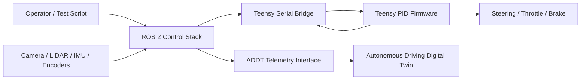
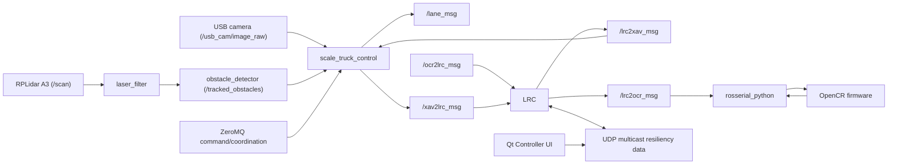

# System Architecture

## Target Architecture

## ROS 1 Reference Architecture

## Main Interfaces

- High-level commands: velocity, steering, stop/go, emergency stop.
- Low-level serial commands: throttle setpoint, steering setpoint, watchdog heartbeat.
- Feedback: encoder speed, steering state, battery or fault status, sensor measurements.
- Digital twin telemetry: pose, velocity, commands, sensor status, test-run metadata.

## Week 1 Architecture Tasks

- Replace placeholder boxes with package and node names after ROS 1 inventory is complete.
- Add topic names, message types, and expected publish rates.
- Document failure paths for communication loss and emergency stop.
