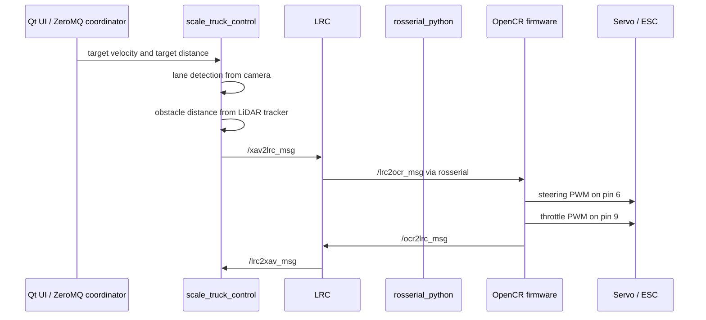

# High-Level Command to Actuator Pipeline

This document traces the ROS 1 reference pipeline from high-level command generation to steering and throttle actuation in `HyeonGyu-Lee/scale_truck_control`.

## End-to-End Flow



## 1. High-Level Command Source

Target velocity and target following distance can enter the system through the external coordination layer:

- ZeroMQ TCP/UDP sockets inside `ZMQ_CLASS`
- Qt desktop controller under `etc/Controller`
- Vehicle-specific config defaults in `config/LV.yaml`, `config/FV1.yaml`, and `config/FV2.yaml`

The vehicle configs define each vehicle's `zipcode`, target velocity, target distance, stop distances, safety distance, lane-control gains, camera calibration, and ROI geometry.

## 2. Xavier-Side Perception and Command Generation

Node:

- Runtime name: `scale_truck_control`
- Executable: `scale_truck_control`
- Main implementation: `src/ScaleTruckController.cpp`

Inputs:

| Topic / Source | Message / Data | Purpose |
| --- | --- | --- |
| `/usb_cam/image_raw` | `sensor_msgs/Image` | Camera image for lane detection. |
| `/tracked_obstacles` | `obstacle_detector/Obstacles` | Tracked obstacle circles/segments from LiDAR. |
| `/lrc2xav_msg` | `scale_truck_control/lrc2xav` | Current velocity feedback. |
| ZeroMQ receive strings | zipcode, target velocity, target distance | External command updates. |

Processing:

1. The node waits until a valid camera frame arrives.
2. `LaneDetector` undistorts and warps the camera frame, thresholds lane markings, fits left/right/center lane polynomials, and computes steering angle.
3. Obstacle processing finds the nearest obstacle from `obstacle_detector/Obstacles`.
4. Velocity is reduced or set to zero if the obstacle is inside the configured stop/safety distance.
5. The controller combines steering angle, target velocity, target distance, current distance, and fault flags into `xav2lrc`.

Outputs:

| Topic | Message | Important fields |
| --- | --- | --- |
| `/xav2lrc_msg` | `scale_truck_control/xav2lrc` | `steer_angle`, `cur_dist`, `tar_dist`, `tar_vel`, `beta`, `gamma` |
| `/lane_msg` | `scale_truck_control/lane_coef` | left, right, and center polynomial coefficients |

## 3. LRC Command Mediation

Node:

- Runtime name: `LRC`
- Executable: `LRC`
- Main implementation: `src/lrc.cpp`
- Meaning: Local Resiliency Coordinator

Inputs:

| Topic / Source | Message / Data | Purpose |
| --- | --- | --- |
| `/xav2lrc_msg` | `scale_truck_control/xav2lrc` | High-level steering, speed, and distance command from Xavier. |
| `/ocr2lrc_msg` | `scale_truck_control/ocr2lrc` | Current velocity and saturated control value from OpenCR. |
| UDP multicast | custom `UDP_DATA` struct | Fault/mode/predicted-velocity data from coordinator or other vehicles. |

Processing:

1. Copies Xavier command values into local state.
2. Copies OpenCR feedback into `CurVel_` and `SatVel_`.
3. Runs a velocity sensor check. If measured velocity differs too much from an observer estimate, it sets `Alpha_ = true`.
4. Computes resiliency mode using `alpha`, `beta`, `gamma`, and CRC/coordinator mode.
5. Publishes the low-level command packet for OpenCR.

Outputs:

| Topic / Output | Message / Data | Important fields |
| --- | --- | --- |
| `/lrc2ocr_msg` | `scale_truck_control/lrc2ocr` | `index`, `steer_angle`, `cur_dist`, `tar_dist`, `tar_vel`, `pred_vel`, `alpha` |
| `/lrc2xav_msg` | `scale_truck_control/lrc2xav` | `cur_vel` |
| UDP multicast | custom `UDP_DATA` struct | vehicle state, fault flags, mode |

## 4. ROS Serial Bridge

Node:

- Runtime name: `serial_node`
- Package/type: `rosserial_python/serial_node.py`
- Launch config: `/dev/ttyACM0`, baud `57600`

Role:

- Carries `/lrc2ocr_msg` from ROS on the Jetson to OpenCR firmware.
- Carries `/ocr2lrc_msg` from OpenCR firmware back to ROS.

This is the key software/hardware boundary in the ROS 1 stack.

## 5. OpenCR Low-Level Control

OpenCR firmware is the code running on the OpenCR 1.0 microcontroller. It is the low-level hardware actuation layer in the ROS 1 scale-truck stack: ROS decides what the truck should do, and OpenCR turns those commands into real PWM signals for the steering servo and throttle ESC.

Plain-language flow:

```text
ROS high-level controller
  -> /xav2lrc_msg
  -> LRC
  -> /lrc2ocr_msg
  -> rosserial over USB
  -> OpenCR firmware
  -> steering servo + throttle ESC
```

Firmware:

- Location: `etc/OpenCR/LV/LV.ino`, `etc/OpenCR/FV1/FV1.ino`, `etc/OpenCR/FV2/FV2.ino`
- Subscribes: `/lrc2ocr_msg`
- Publishes: `/ocr2lrc_msg`

Inputs from ROS:

| Field | Meaning |
| --- | --- |
| `index` | Vehicle index used to distinguish leader/follower behavior. |
| `steer_angle` | Desired steering angle from lane controller. |
| `cur_dist` | Current detected distance to lead object/vehicle. |
| `tar_dist` | Desired following distance. |
| `tar_vel` | Desired target velocity. |
| `pred_vel` | Predicted velocity for fault fallback. |
| `alpha` | Velocity sensor fault flag from LRC. |

Feedback to ROS:

| Field | Meaning |
| --- | --- |
| `cur_vel` | Measured velocity from wheel encoder. |
| `u_k` | Saturated velocity/control value used by LRC observer. |

OpenCR's main responsibilities:

- Receive desired steering angle, target velocity, current distance, target distance, predicted velocity, and fault status from ROS.
- Read the wheel encoder to estimate current speed.
- Run low-level speed control for throttle.
- Convert steering commands to servo PWM.
- Clamp throttle and steering outputs to safe ranges.
- Publish measured velocity and saturated control feedback back to ROS.

## 6. Throttle Actuation

Firmware function:

- `setSPEED(float tar_vel, float cur_vel)`

Pipeline:

1. Encoder interrupt counts wheel ticks on pins `3` and `2`.
2. `CheckEN()` converts ticks into current velocity using wheel diameter and tick count.
3. If `alpha` is true, firmware uses `pred_vel` instead of measured velocity for control.
4. Leader vehicle uses target velocity directly.
5. Follower vehicles adjust reference velocity using distance error:

```text
distance error = current distance - target distance
reference velocity = target velocity + PD(distance error)
```

6. Speed controller computes a velocity command using proportional, integral, anti-windup, and feed-forward terms.
7. Command is saturated to `0.0` through `2.0 m/s`.
8. Firmware converts the saturated speed command to throttle PWM using a calibrated inverse polynomial.
9. Throttle/ESC receives PWM on pin `9`.

Important constants:

| Constant | Value |
| --- | --- |
| Throttle pin | `9` |
| Zero PWM | `1500 us` |
| Minimum throttle PWM | `1600 us` |
| Maximum throttle PWM | `2000 us` |
| Speed control period | `100000 us` / `0.1 s` |
| Wheel diameter | `0.085 m` |
| Encoder ticks per wheel cycle | `60` |

## 7. Steering Actuation

Firmware function:

- `setANGLE()`

Pipeline:

1. OpenCR receives `steer_angle` from `/lrc2ocr_msg`.
2. Firmware updates IMU readings for local status/logging.
3. Steering command is converted directly to servo PWM:

```text
steering PWM = steer_angle * 12.0 + STEER_CENTER
```

4. PWM is clamped between `MIN_STEER` and `MAX_STEER`.
5. Steering servo receives PWM on pin `6`.

Important constants:

| Constant | Value |
| --- | --- |
| Steering pin | `6` |
| Steering center | `1480 us` |
| Minimum steering PWM | `1200 us` |
| Maximum steering PWM | `1800 us` |
| Steering update period | `33000 us` / about `30 Hz` |

## 8. Safety and Stop Behavior

High-level Xavier safety:

- Leader stops if nearest obstacle distance is below `lv_stop_dist`.
- Follower stops if nearest obstacle distance is below `fv_stop_dist`.
- Velocity is reduced inside `safety_dist`.

Firmware safety:

- If `tar_vel <= 0`, throttle output returns to `ZERO_PWM`.
- Throttle command is saturated to a bounded velocity range.
- Steering PWM is clamped to the configured min/max range.

Fault-coordination signals:

| Flag | Meaning in the reference code |
| --- | --- |
| `alpha` | Velocity sensor / encoder fault detected by LRC observer. |
| `beta` | Camera failure flag used in Xavier/LRC mode logic. |
| `gamma` | Additional fault flag passed through Xavier and LRC mode logic. |

## ROS 2 Migration Implications

For the ROS 2 rewrite, this pipeline suggests these package boundaries:

- `scale_truck_perception`: camera lane detection and LiDAR obstacle processing.
- `scale_truck_control`: command arbitration, safety-distance logic, and high-level steering/speed output.
- `scale_truck_resiliency`: LRC-like fault detection and mode logic, if retained.
- `scale_truck_firmware_bridge`: serial or micro-ROS bridge to Teensy/OpenCR.
- `scale_truck_msgs`: ROS 2 versions of `xav2lrc`, `lrc2ocr`, `ocr2lrc`, `lane`, and `lane_coef`.
