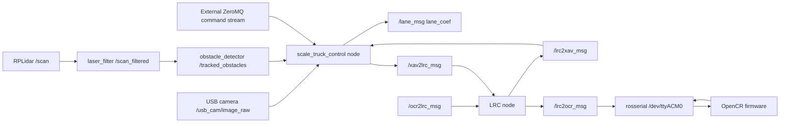

# ROS 1 Architecture Inventory

This review is based on the public reference repository `HyeonGyu-Lee/scale_truck_control`, default branch `master`, inspected on 2026-06-25.

Reference links:

- Repository: https://github.com/HyeonGyu-Lee/scale_truck_control
- Primary launch file: https://github.com/HyeonGyu-Lee/scale_truck_control/blob/master/launch/LV.launch
- Main controller: https://github.com/HyeonGyu-Lee/scale_truck_control/blob/master/src/ScaleTruckController.cpp
- LRC node: https://github.com/HyeonGyu-Lee/scale_truck_control/blob/master/src/lrc.cpp
- OpenCR firmware: https://github.com/HyeonGyu-Lee/scale_truck_control/tree/master/etc/OpenCR
- Detailed command-to-actuator pipeline: [control_pipeline.md](control_pipeline.md)

## Package Summary

- Package name: `scale_truck_control`
- Build system: ROS 1 `catkin`
- Main language: C++ for ROS nodes, Arduino/OpenCR C++ for firmware, Qt C++ for desktop control UI
- ROS version documented by README: ROS 1 Melodic on Ubuntu 18.04
- Main computer documented by README: Nvidia Jetson AGX Xavier
- Low-level controller documented by README: OpenCR 1.0

## Build Dependencies

Declared in `CMakeLists.txt`:

- `roscpp`
- `rospy`
- `std_msgs`
- `sensor_msgs`
- `image_transport`
- `geometry_msgs`
- `cv_bridge`
- `message_generation`
- `obstacle_detector`
- OpenCV 4.4.0 with CUDA modules
- Boost thread and Python
- ZeroMQ / cppzmq

Declared in `package.xml`:

- `catkin`
- `roscpp`
- `rospy`
- `std_msgs`
- `message_generation`
- `message_runtime`
- `obstacle_detector`
- `geometry_msgs`

Runtime dependencies from launch files and README:

- `usb_cam`
- `rplidar_ros`
- `laser_filters`
- `obstacle_detector`
- `rosserial_python`
- `vision_opencv` / `cv_bridge`
- `rosserial_arduino`

## Repository Layout

- `launch/`: vehicle launch files for LV, FV1, FV2, lane-camera variants, rosbag image extraction.
- `config/`: shared controller config, per-vehicle calibration and control gains, LRC config, LiDAR filter config.
- `msg/`: custom ROS 1 messages exchanged between Xavier, LRC, OpenCR, and lane detector.
- `nodes/`: ROS node entrypoints.
- `src/` and `include/`: controller, lane detection, LRC, ZeroMQ, and UDP helper code.
- `etc/OpenCR/`: OpenCR firmware for LV, FV1, FV2.
- `etc/Controller/`: Qt desktop controller UI using UDP multicast.
- `etc/Track/`: physical/virtual track drawings and images.

## Launch Files

| File | Purpose | Main nodes |
| --- | --- | --- |
| `launch/LV.launch` | Leader vehicle bringup without second lane camera | `usb_cam`, `rplidarNode`, `laser_filter`, `obstacle_extractor`, `obstacle_tracker`, `scale_truck_control`, `LRC`, `serial_node` |
| `launch/FV1.launch` | Follower 1 bringup | Same as LV with `config/FV1.yaml` |
| `launch/FV2.launch` | Follower 2 bringup | Same as LV with `config/FV2.yaml` |
| `launch/laneCam_LV.launch` | LV bringup with an additional `/lane_cam` camera | Same as LV plus second `usb_cam` node on `/dev/video2` |
| `launch/laneCam_FV1.launch` | FV1 bringup with additional lane camera | Same pattern as `laneCam_LV.launch` |
| `launch/laneCam_FV2.launch` | FV2 bringup with additional lane camera | Same pattern as `laneCam_LV.launch` |
| `launch/lane_cam.launch` | Standalone lane camera test | `usb_cam` remapped to `/lane_cam` |
| `launch/jpeg.launch` | Rosbag image extraction | `rosbag play`, `image_view/extract_images` |

Notes:

- `laneCam_LV.launch` references `$(arg lrc_param_file)` but does not define that arg. This should be fixed during migration.
- `ScaleTruckController` defaults its obstacle subscriber to `/raw_obstacles`, but `config/config.yaml` sets it to `/tracked_obstacles`. The launch starts both obstacle extraction and tracking, so the configured runtime topic is expected to be `/tracked_obstacles`.

## ROS Nodes

| Runtime node name | Executable/package | Source | Role |
| --- | --- | --- | --- |
| `scale_truck_control` | `scale_truck_control/scale_truck_control` | `nodes/control_node.cpp`, `src/ScaleTruckController.cpp` | Main Xavier-side perception and high-level control node. Consumes camera, obstacle, and current velocity feedback; publishes steering/velocity commands to LRC and lane coefficients. |
| `LRC` | `scale_truck_control/LRC` | `nodes/lrc_node.cpp`, `src/lrc.cpp` | Local Resiliency Coordinator. Bridges Xavier commands to OpenCR, receives OpenCR velocity feedback, detects sensor/velocity faults, sends/receives UDP resiliency data. |
| `usb_cam` | `usb_cam/usb_cam_node` | external | Main USB camera driver on `/dev/video0`, 640x480, YUYV. |
| `lane_cam` | `usb_cam/usb_cam_node` | external | Optional lane camera on `/dev/video2`, 640x360, remapped to `/lane_cam`. |
| `rplidarNode` | `rplidar_ros/rplidarNode` | external | RPLidar A3 driver on `/dev/ttyUSB0`, 256000 baud, frame `laser`. |
| `laser_filter` | `laser_filters/scan_to_scan_filter_chain` | external | Angular bounds filter for LiDAR scans. |
| `obstacle_extractor` | `obstacle_detector/obstacle_extractor_node` | external | Extracts segments/circles from filtered scans. |
| `obstacle_tracker` | `obstacle_detector/obstacle_tracker_node` | external | Tracks obstacles, configured at 30 Hz. |
| `serial_node` | `rosserial_python/serial_node.py` | external | ROS serial bridge to OpenCR on `/dev/ttyACM0`, 57600 baud. |

## Topic Inventory

| Topic | Direction | Message type | Producer | Consumer | Notes |
| --- | --- | --- | --- | --- | --- |
| `/usb_cam/image_raw` | sensor input | `sensor_msgs/Image` | `usb_cam` | `scale_truck_control` | Main camera image. |
| `/lane_cam/image_raw` | sensor input | `sensor_msgs/Image` | optional `lane_cam` | not directly used by default config | Standalone/additional lane camera path. |
| `/scan` | sensor input | `sensor_msgs/LaserScan` | `rplidarNode` | `laser_filter`, obstacle nodes via remap | Raw RPLidar scan. |
| `/scan_filtered` | sensor processing | `sensor_msgs/LaserScan` | `laser_filter` | `obstacle_extractor`, `obstacle_tracker` | Angular range filtered to -2.62..2.62 rad. |
| `/raw_obstacles` | perception | `obstacle_detector/Obstacles` | `obstacle_extractor` | possible default `scale_truck_control` input | Code default only. |
| `/tracked_obstacles` | perception | `obstacle_detector/Obstacles` | `obstacle_tracker` | `scale_truck_control` | Runtime configured in `config/config.yaml`. |
| `/lane_msg` | perception output | `scale_truck_control/lane_coef` | `scale_truck_control` | Qt UI / telemetry consumers | Left, right, and center polynomial coefficients. |
| `/xav2lrc_msg` | command | `scale_truck_control/xav2lrc` | `scale_truck_control` | `LRC` | Steering angle, current distance, target distance, target velocity, beta/gamma fault flags. |
| `/lrc2xav_msg` | feedback | `scale_truck_control/lrc2xav` | `LRC` | `scale_truck_control` | Current velocity feedback from OpenCR via LRC. |
| `/lrc2ocr_msg` | low-level command | `scale_truck_control/lrc2ocr` | `LRC` | OpenCR via `rosserial_python` | Vehicle index, steering, distance, velocity, predicted velocity, alpha flag. |
| `/ocr2lrc_msg` | low-level feedback | `scale_truck_control/ocr2lrc` | OpenCR via `rosserial_python` | `LRC` | Current velocity and saturated velocity/control value. |

No ROS services or actions were found in the package.

## Custom Messages

### `lane.msg`

```text
float32 a
float32 b
float32 c
```

Represents one quadratic lane polynomial.

### `lane_coef.msg`

```text
lane left
lane right
lane center
```

Carries fitted left, right, and center lane curves.

### `xav2lrc.msg`

```text
float32 steer_angle
float32 cur_dist
float32 tar_dist
float32 tar_vel
bool beta
bool gamma
```

Xavier-to-LRC command and perception status.

### `lrc2xav.msg`

```text
float32 cur_vel
```

LRC-to-Xavier speed feedback.

### `lrc2ocr.msg`

```text
int32 index
float32 steer_angle
float32 cur_dist
float32 tar_dist
float32 tar_vel
float32 pred_vel
bool alpha
```

LRC-to-OpenCR low-level command packet.

### `ocr2lrc.msg`

```text
float32 cur_vel
float32 u_k
```

OpenCR-to-LRC feedback with measured speed and saturated velocity/control value.

## Control Pipeline



High-level behavior:

1. `scale_truck_control` waits for a camera frame, then runs lane detection and obstacle processing in worker threads.
2. Lane detection uses OpenCV CUDA for undistortion, perspective warp, grayscale thresholding, and sliding-window lane fitting.
3. Obstacle processing reads `obstacle_detector/Obstacles`, estimates nearest obstacle distance/angle, and adjusts velocity for emergency stop or safe following.
4. ZeroMQ inputs update target velocity/distance from an external coordinator or dashboard.
5. `scale_truck_control` publishes steering angle and target velocity/distance as `/xav2lrc_msg`.
6. `LRC` adds resiliency state, publishes `/lrc2ocr_msg` to OpenCR, and returns `/lrc2xav_msg` current velocity to Xavier.
7. OpenCR runs low-level speed/steering control, drives servo PWM outputs, reads encoder ticks and IMU, and publishes `/ocr2lrc_msg`.

## Non-ROS Communication

### ZeroMQ

`ZMQ_CLASS` supports:

- TCP SUB/PUB on configured ports, default `5555`
- TCP REQ/REP on configured ports, default `4444`
- UDP RADIO/DISH draft sockets on configured multicast endpoint
- Vehicle `zipcode` values:
  - LV: `00000`
  - FV1: `00001`
  - FV2: `00002`

`config/config.yaml` sets:

- TCP IP: `tcp://192.168.0.18`
- Interface: `wlan0`
- UDP IP: `udp://239.255.255.250`

### LRC UDP Multicast

`LRC` uses a custom UDP struct over multicast:

- Group: `239.255.255.250`
- Port: `9392`
- Struct fields include vehicle index, target/current/predicted velocity, target/current distance, current angle, lane coefficients, ROI distance, fault flags `alpha/beta/gamma`, and mode.

### Qt Controller UDP

The Qt controller in `etc/Controller` is a desktop UI for platoon commands and monitoring. It sends target velocity/distance over multicast group `239.255.255.250`, port `9307`, and displays current velocity, distance, lane curves, ROI distance, and obstacle position.

## Hardware Interfaces

### High-Level Controller

Documented hardware:

- Nvidia Jetson AGX Xavier
- ELP USB camera
- RPLidar A3
- OpenCR 1.0 low-level controller

Launch configuration:

- Main camera: `/dev/video0`, 640x480, YUYV, `mmap`
- Optional lane camera: `/dev/video2`, 640x360, YUYV, remapped to `/lane_cam`
- LiDAR: `/dev/ttyUSB0`, baud `256000`, scan mode `Stability`, frame `laser`
- OpenCR rosserial: `/dev/ttyACM0`, baud `57600`

### OpenCR Firmware

OpenCR firmware exists for LV, FV1, FV2. The firmware subscribes to `/lrc2ocr_msg` and publishes `/ocr2lrc_msg`.

Pins and constants from firmware:

- Steering servo pin: `6`
- Throttle servo/ESC pin: `9`
- Encoder pins: `3` and `2`
- SD card pin: `10`
- Wheel diameter: `0.085 m`
- Encoder conversion: `60` ticks per wheel cycle
- Max speed constant: `2 m/s`
- Throttle PWM: zero `1500`, min `1600`, max `2000`
- Steering PWM: center `1480`, min `1200`, max `1800`
- Speed control cycle: `100000 us` / `0.1 s`
- Steering update cycle: `33000 us` / about `30 Hz`

Firmware behavior:

- Converts encoder ticks to current velocity.
- Runs longitudinal PID-like velocity control with feed-forward and anti-windup term.
- For followers, adjusts reference velocity using distance error against target distance.
- Converts steering angle command to servo PWM with `angle * 12 + STEER_CENTER`.
- Uses IMU data internally for logging/status, but does not publish a ROS IMU topic in the inspected firmware.
- Logs test data to SD card when enabled.

## Vehicle-Specific Configuration

| Vehicle | `params/truck_info` | `zipcode` | UDP send group | UDP receive group | Config file |
| --- | ---: | --- | --- | --- | --- |
| LV | defaults to `0` | `00000` | `FV1` | `LV` | `config/LV.yaml` |
| FV1 | defaults to `0` unless set elsewhere | `00001` | `FV2` | `FV1` | `config/FV1.yaml` |
| FV2 | defaults to `0` unless set elsewhere | `00002` | `FV3` | `FV2` | `config/FV2.yaml` |

The inspected YAML files contain vehicle-specific camera calibration, ROI geometry, lane-control coefficients, stop distances, and ZeroMQ routing.

Important: `LRC` reads `params/truck_info` for the vehicle index, but this key was not present in the inspected `LV.yaml`, `FV1.yaml`, `FV2.yaml`, `config.yaml`, or `lrc.yaml` files. Confirm whether this parameter is set from another launch file, command line, or runtime parameter server state before preserving the same indexing logic in ROS 2.

## Fault and Safety Signals

- `alpha`: velocity sensor / encoder inconsistency detected in LRC. OpenCR can use predicted velocity instead of measured velocity when `alpha` is true.
- `beta`: camera failure flag used by Xavier/LRC mode logic.
- `gamma`: additional fault flag carried through Xavier/LRC messages.
- Emergency stop in Xavier:
  - LV stops when nearest obstacle distance is below `lv_stop_dist`.
  - Followers stop when distance is below `fv_stop_dist` or target velocity is very low.
- Firmware stop:
  - Throttle command returns to `ZERO_PWM` when target velocity is less than or equal to zero.

## ROS 2 Migration Notes

Keep or port:

- Custom message definitions, but move them into a dedicated ROS 2 interface package such as `scale_truck_msgs`.
- Main controller node behavior, split into smaller ROS 2 nodes where practical: lane detection, obstacle processing, command arbitration, and telemetry.
- LRC behavior if resiliency/fault-mode coordination remains in scope.

Replace:

- `catkin` with `ament_cmake` or `ament_python`.
- XML launch files with ROS 2 Python launch files.
- `ros::NodeHandle` parameters with declared ROS 2 parameters.
- `rosserial_python` with a Teensy/OpenCR serial bridge node or micro-ROS, depending on final low-level controller choice.
- ROS 1 `usb_cam`, `rplidar_ros`, `laser_filters`, and `obstacle_detector` with ROS 2-compatible equivalents or local ports.

Clarify before implementation:

- Whether the new platform uses Teensy or OpenCR for low-level control.
- Whether ZeroMQ and Qt controller remain part of the target architecture.
- Whether the ADDT interface should consume `/lane_msg`, vehicle state, command topics, or a new consolidated telemetry message.
- Whether camera failure detection and alpha/beta/gamma fault modes are required for the capstone demo.
