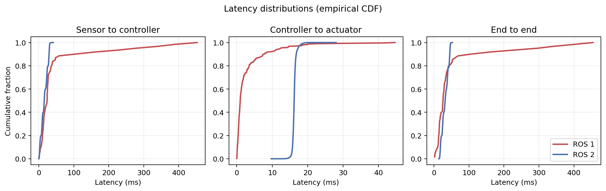
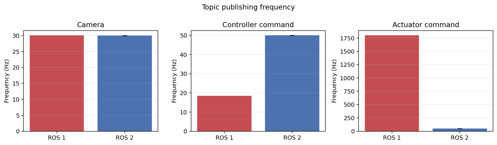
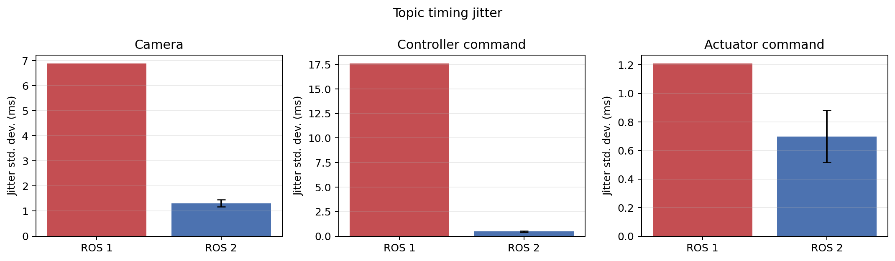

# ROS 1 vs. ROS 2 Latency Comparison

## Scope and method

This report compares the saved ROS 1 baseline with five ROS 2 software-only
runs. Both analyzers use bag receive timestamps and the same temporal
correlation rule: the latest sensor message before a controller command and the
first actuator command after that controller command. ROS 2 latency samples are
pooled across the five runs; ROS 2 frequency and jitter values are means across
runs. The `+/-` values below are population standard deviations between runs.

## Performance comparison

| Metric | ROS 1 | ROS 2 (5 runs) | Interpretation |
|---|---:|---:|---|
| Sensor-to-controller mean | 49.90 ms | 15.82 ms | ROS 2 estimate is 68.3% lower |
| Sensor-to-controller median | 23.77 ms | 15.37 ms | ROS 2 estimate is 35.3% lower |
| Sensor-to-controller p95 | 276.98 ms | 30.00 ms | ROS 2 tail is 89.2% lower |
| Controller-to-actuator mean | 2.89 ms | 16.24 ms | ROS 2 central delay is higher |
| Controller-to-actuator median | 0.99 ms | 16.19 ms | Independent 50 Hz timer phase dominates ROS 2 |
| Controller-to-actuator p95 | 12.37 ms | 17.27 ms | ROS 2 p95 is 39.6% higher |
| Controller-to-actuator standard deviation | 5.34 ms | 0.60 ms | ROS 2 variability is 88.7% lower |
| End-to-end mean | 54.85 ms | 32.07 ms | ROS 2 estimate is 41.5% lower |
| End-to-end median | 26.27 ms | 32.19 ms | ROS 2 median is 22.6% higher |
| End-to-end p95 | 295.34 ms | 46.22 ms | ROS 2 tail is 84.4% lower |
| End-to-end standard deviation | 92.22 ms | 9.58 ms | ROS 2 variability is 89.6% lower |
| Camera frequency | 30.07 Hz | 30.00 +/- 0.01 Hz | Equivalent requested input rate |
| Controller-command frequency | 18.46 Hz | 50.00 +/- 0.00 Hz | ROS 2 uses an explicit 50 Hz timer |
| Actuator-command frequency | 1800.00 Hz | 50.00 +/- 0.00 Hz | ROS 2 removes the unbounded ROS 1 loop |
| Camera jitter | 6.88 ms | 1.32 +/- 0.13 ms | 80.9% lower in this synthetic ROS 2 input |
| Controller-command jitter | 17.57 ms | 0.48 +/- 0.07 ms | 97.3% lower with the ROS 2 timer |
| Actuator-command jitter | 1.21 ms | 0.70 +/- 0.18 ms | 42.2% lower |
| CPU utilization | Not measured | Not measured | No defensible comparison available |

Exact values and pooled sample counts are stored in
[`ros1-ros2-summary.json`](../../results/latency/comparison/ros1-ros2-summary.json)
and [`ros1-ros2-comparison.csv`](../../results/latency/comparison/ros1-ros2-comparison.csv).

## Plots

## Does ROS 2 improve control-system timing?

The measured ROS 2 implementation is substantially more deterministic. Its
sensor-to-controller and end-to-end tail latencies are much smaller, and the
standard deviation of every latency path is lower. The controller command is a
stable 50 Hz instead of approximately 18.5 Hz, while the actuator command is
intentionally limited to 50 Hz instead of the ROS 1 stack's uncontrolled
approximately 1800 Hz. Those changes make the ROS 2 control schedule more
predictable and appropriate for a 50 Hz control loop.

ROS 2 does not improve every central latency value. Controller-to-actuator mean
and median latency increased because the ROS 2 controller and LRC publish on
independent 20 ms timers; a command commonly waits for the next LRC timer tick.
The ROS 2 end-to-end median is consequently 22.6% higher, even though its mean,
p95, p99, and variability are far better. A callback-driven handoff or a shared
timer/trace design would reduce that phase delay.

These results must not be interpreted as a controlled benchmark of ROS 1
middleware versus ROS 2 DDS. The ROS 1 baseline used a substitute camera bag
and only one run, while ROS 2 used a minimal synthetic image at 30 Hz and five
runs. The current ROS 2 image callback does not perform the legacy ROS 1 image
processing, and neither custom-message pipeline propagates a common trace ID.
The strongest supported conclusion is therefore that the current ROS 2
implementation has a much more stable, bounded publication schedule under its
software-only test workload—not that ROS 2 middleware alone caused the gains.

## Recommended follow-up

For a causal and publication-grade comparison, add a trace ID and sensor
acquisition timestamp to the command messages, run the same image-processing
workload in both stacks, collect at least five ROS 1 runs, and record CPU and
memory samples under identical Xavier power and DDS/network conditions.
